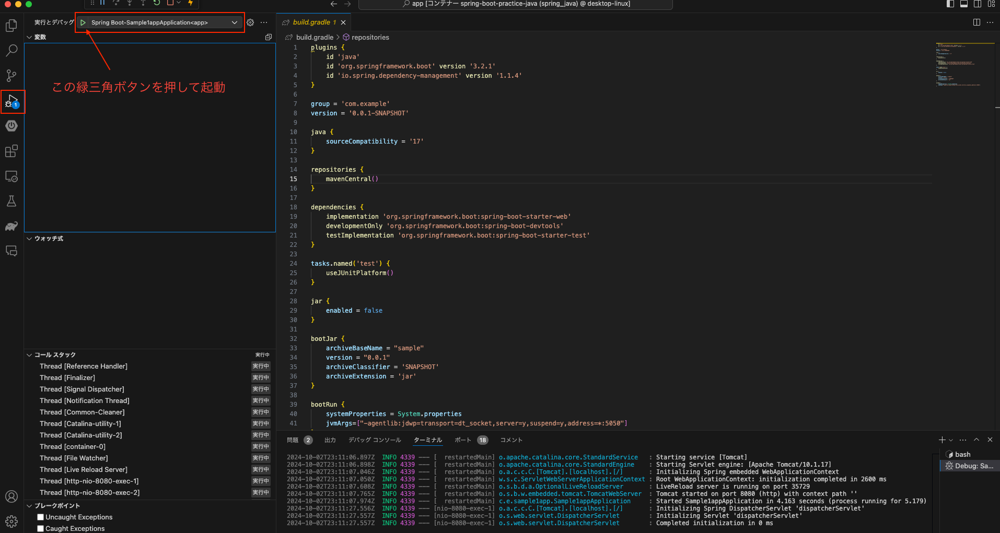

## 開発環境構築
### 前提
- 以下をインストールしておくこと。
  - [Docker for Mac](https://docs.docker.com/desktop/install/mac-install/)
  - [VSCode](https://code.visualstudio.com/download)

### 1. Docker Compose を使って開発環境を作成
1. Terminalから、`spring-boot-practice` があるディレクトリに移動する。
2. 以下、Terminal操作
    ```bash
    # Dockerコンテナの作成
    $ docker compose up -d --build
    ### コンテナ立ち上げ処理が走り始めるので、終了まで待つ
    ```

### 2. VSCodeの準備
1. VSCodeの拡張機能から、`Dev Containers` を検索し、インストールする。

### 3. `Dev Containers` を使って、コンテナ上のソースを開く
1. サイドバーに、`リモート エクスプローラー` のアイコンがあるので、それをクリックする。
2. 出てきたコンテナ一覧から、`spring-boot-practice spring_java` というものを見つけ `→` の右隣の「フォルダ追加」っぽいマークをクリックする。
3. 新しいウィンドウで、コンテナ上のSpringコードが開く

### 4. コンテナ内のVSCodeの準備
1. コンテナ内を表示するVSCodeの拡張機能から、以下のプラグインを検索してインストールする
   - vscjava.vscode-java-pack
   - vmware.vscode-boot-dev-pack
   - vscjava.vscode-gradle
   - shardulm94.trailing-spaces
   - christian-kohler.path-intellisense
   - MS-CEINTL.vscode-language-pack-ja
   - aaron-bond.better-comment

### 5. Springを起動してみる
1. サイドバーの「実行とデバッグ」タブを選択し、サーバー起動する（キャプチャ参照）
   1. うまく立ち上がらない場合、 `Spring Boot-Sample1appApplication<app>` が指定されているかを確認してみること。
  
2. `localhost:8080` にアクセスしてみると、 `Hello World` とデフォルトで表示される。

## よく使うコマンド

### Docker Compose

```bash

## docker compose の起動
docker compose up -d --build

## docker compose の再起動
docker compose restart

## docker compose の停止
docker compose stop

## docker compose の終了（コンテナ停止 + コンテナ削除）
docker compose down

# docker compose の起動状況確認
docker compose ps -a

# docker compose のコンテナ内にアクセス（SERVICE には、 `java`, `mysql` といった、docker-compose.yml のサービス名が入る
docker compose exec {SERVICE} bash
```

### DB接続情報

- /docker/mysql/db.env に格納済